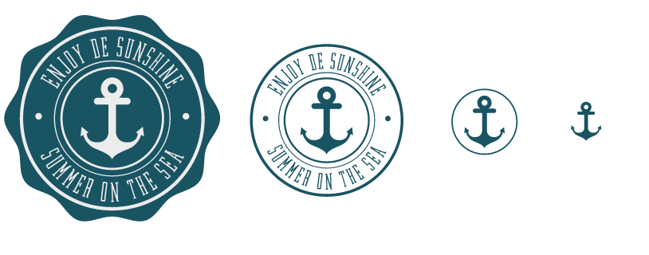
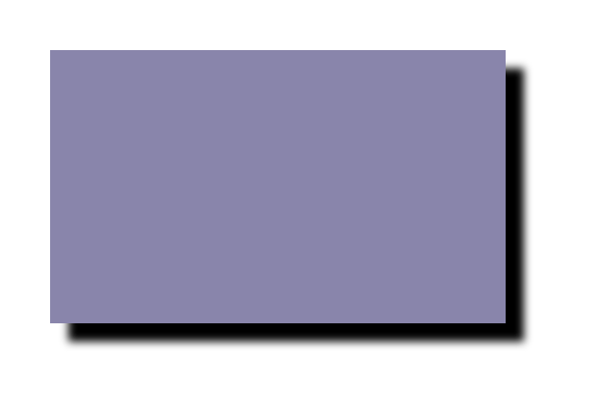
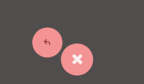
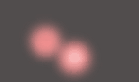
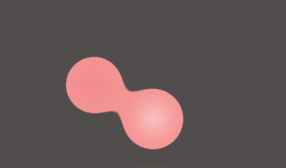

# SVG Notes

##### Table of Contents:

<ul class="toc">
  <li>
    <a href="#preparing">Preparing</a>
  </li>
  <li>
    <a href="#optimizing">Optimizing</a>
  </li>
  <li>
    <a href="#implementation-options">Implementation Options</a>
  </li>
  <li>
    <a href="#responsive-svg">Responsive SVG</a>
  </li>
  <li>
    <a href="#styling">Styling</a>
  </li>
  <li>
    <a href="#animation-basics">Animation Basics</a>
  </li>
  <li>
    <a href="#animation-deep-dive-using-gsap">Animation Deep Dive using GSAP</a>
  </li>
  <li>
    <a href="#svg-filters--gooey-effects">SVG Filters & Gooey Effects</a>
  </li>
  <li>
    <a href="#references">References</a>
  </li>
</ul>

## Preparing

* Any names given layers / groups will be added into the SVG as an ID on that element (_note:_ this adds file size)
* When exporting SVG files, ensure the x & y positions are integer values on the pixel grid (i.e. 23.0 x 87.0, not 23.3px × 86.8px)
* Crop the artboard around the image (in Adobe Illustrator: `Object > Artboards > Fit to Artwork Bounds`)

## Optimizing

* [SVGO GUI](https://github.com/svg/svgo-gui) is an easy to use, drag & drop GUI that optimizes SVG files by minimizing and stripping out unnecessary code. (_note:_ it does, however, remove layer names.)
* For more options in a visual, web-based tool, [Peter Collingridge’s SVG Editor](http://petercollingridge.appspot.com/svg-editor) is a phenomenal resource
* [Paid] Illustrator Plugin, [VectorScribe](http://www.astutegraphics.com/software/vectorscribe/), removes unnecessary points from your paths via its _Smart Remove Brush Tool_
* Move path points to integer values on the pixel grid. (in illustrator, turn on `View > Pixel Preview` & zoom in)

**Further Optimizations [for the nerds]**

* SVGO comes in [command line flavor](https://github.com/svg/svgo) w/ many more options, as well.
* Enable gzip compression for SVGs on your websites in the `.htaccess`file:

~~~apacheconf
AddType image/svg+xml svg svgz
<IfModule mod_deflate.c>
    <IfModule mod_filter.c>
        AddOutputFilterByType DEFLATE "image/svg+xml" \
                                      "text/css" \
                                      "text/html" \
                                      "text/javascript"
                                      ... etc
    </IfModule>
</IfModule>
~~~

## Implementation Options

1. `Your browser does not support SVGs</object>` does allow for image manipulation
3. Inline in the HTML, i.e. `<svg viewBox="0 0 68 65"> <path d="…/>` saves an HTTP request, but the SVG file is not cached by the browser.

**Understanding the `viewBox` Attribute**:

* Defines aspect ratio, scale & origin of the SVG's coordinate system
* Its four values are `x`, `y`, `width`, `height`
* By default, it will not be stretched or distorted if you give it dimensions that don't match the aspect ratio
* The `preserveAspectRatio` property describes how the image should scale if the aspect ratio of the viewBox doesn't match the aspect ratio of the viewport
 * Default value is `preserveAspectRatio="xMidYMid meet"`
 * `xMidYMid` centers the scaled viewBox region w/in the available viewport region, in both x/y directions. You can replace `Mid` with `Min` or `Max` to align the graphic flush against one side or the other
 * `meet` tells the browser to scale the graphic until it just fits both height and width. (a la `background-size: fit`) Alternative value is `slice` (equivalent to `background-size: cover`)
 * `preserveAspectRatio="none"` allows you to manually scale your SVG, just as you would a raster image.

**Overview:**

|_Approaches:_                   | `<object>`  | Inline | ``     | `background-image` |
|:------------------------------|-------------|--------|-------------|--------------------|
| **CSS Manipulation**          | Yes         | Yes    | Some inline | Some inline        |
| **JS Manipulation**           | Yes         | Yes    | No          | No                 |
| **SVG Animation**             | Yes         | Yes    | Yes         | Yes                |
| **Interactive SVG Animation** | Yes         | Yes    | No          | No                 |

## Responsive SVG

**Overview**

1. **`<object>`**
 * Works as expected with `width: 100%;`
2. **Inline**
 * Previously needed a `max-height` value to work, now works as expected. _**Note:**_ Safari doesn’t redraw these as quickly (if they are complex) on window resize.
3. **``**
 * Works as expected with `width: 100%;`
4. **`background-image`**
 * Needs `padding-bottom: #%;` to keep the proportions of the image else it will not show.

**Making `` and `<object>` embedded SVGs Fluid Using CSS**

1. Remove the `height` and `width` attributes
2. Leave the `viewBox` attribute (add if not already present)
3. Set `preserveAspectratio` to `xMidYMid meet`
4. IE height bug fix: `img { width: 100%; }` / `object { width: 100%; }`

**Working with inline SVG**

* The SVG viewport is established by the height and width specified on the root `<svg … >`
* When w/h are removed, all browsers assume a width equal to 100% and stretch the SVG horizontally to fit the width of its container.
* Chrome & FF scale SVG as expected
* IE requires the below padding hack to scale our responsive SVG:

**HTML:**

~~~html

    <svg … ></svg>

~~~

**CSS:**

~~~css
.container {
  width: 50%;
  height: 0;
  padding-top: 48%;
  position: relative;
}

svg {
  position: absolute;
  top: 0;
  left: 0;
}
~~~

_**Note:** the svg does not need a height and width set to fit inside the container._

**Example of Adaptive SVG Using CSS Media Queries**

The following code:

**HTML:**

~~~html
<svg xmlns="http://www.w3.org/2000/svg" version="1.1" viewBox="0 0 194 186">
  <path id="curved_bg" fill="#195463" d="..." />
  <g id="primary_content" fill="#ECECEC">
    <path id="icon" d="..." />
    <path id="inner-circle" d="..." />
    <path id="middle-circle" d="..." />
  </g>
  <g id="secondary_content" fill="#ECECEC">
    <path id="bottom-text" d="..." />
    <path id="upper-text" d="..." />
    <path id="outer-circle" d="..." />
    <circle id="left-dot" cx="31.1" cy="91.5" r="3" />
    <circle id="right-dot" cx="163.4" cy="91.5" r="3" />
  </g>
</svg>
~~~

**CSS:**

~~~css
@media all and (max-width: 250px) {
  #curved_bg { 
    opacity: 0; 
  }
  #secondary_content, #primary_content { 
    fill: #195463; 
  }
}
@media all and (max-width: 200px) {
  #secondary_content {
    opacity: 0;
  }
}
@media all and (max-width: 150px) {
  #inner-circle, #middle-circle {
    opacity: 0;
  }
}
~~~

Produces the below result:

**How to Change Per-breakpoint `viewBox` Dimensions w/ JavaScript**

Listen for media query events & change viewBox size, accordingly:

~~~js
var shape = document.getElementById("svg");

// media query event handler
if (matchMedia) {
  var mq = window.matchMedia("(min-width: 500px)");
  mq.addListener(WidthChange);
  WidthChange(mq);
}

// media query change
function WidthChange(mq) {
  if (mq.matches) {
    shape.setAttribute("viewBox", "0 0 490 474");
    shape.setAttribute("enable-background", "0 0 490 474");
  } else {
    shape.setAttribute("viewBox", "0 490 500 500");
    shape.setAttribute("enable-background", "0 490 500 500");
  }
}
~~~

## Styling

The following is a subset of all SVG presentation attributes that can be set using CSS:

* **Font properties:**
 * `font`
 * `font-family`
 * `font-size`
 * `font-size-adjust`
 * `font-stretch`
 * `font-style`
 * `font-variant`
 * `font-weight`

* **Text properties:**
 * `direction`
 * `letter-spacing`
 * `text-decoration`
 * `unicode-bidi`
 * `word-spacing`

* **Other properties for visual media:**
 * `clip`, only applicable to outermost svg element.
 * `color`, used to provide a potential indirect value (currentColor) for the `fill`, `stroke`, `stop-color`, `flood-color` and `lighting-color` properties. (The SVG properties which support color allow a color specification which is extended from CSS2 to accommodate color definitions in arbitrary color spaces. See Color profile descriptions.)
 * `cursor`
 * `display`
 * `overflow`, only applicable to elements which establish a new viewport.
 * `visibility`

_**Note:** the `x`, `y`, `width` and `height` attributes cannot currently be set using CSS; in SVG2, however, they will be available to be set via CSS._

**SVG-Only Attributes:**

* clip-rule
* flood-color
* flood-opacity
* stop-opacity
* kerning
* tech-anchor
* color-profile
* color-rendering
* fill
* fill-opacity
* fill-rule
* marker
* marker-end
* marker-mid
* marker-start
* stroke
* stroke-width
* stop-color
* lighting-color
* enable-background
* dominant-baseline
* color-interpolation-filters
* color-interpolation
* glyph-orientation-horizontal
* glyph-orientation-vertical
* shape-rendering
* baseline-shift
* alignment-baseline
* stroke-miterlimit
* stroke-linejoin
* stroke-linecap
* stroke-dashoffset
* stroke-dasharray
* stroke-opacity

## Animation Basics

**3 options:**

1. SVG animation (based on the SMIL spec)
2. CSS3 animations
3. JS animations

**CSS Animation:**

**HTML:**

~~~html
<svg xmlns="http://www.w3.org/2000/svg" viewBox="0 0 68 65">
  
  <path class="secondb" d="M42 27v-20c0-3.7-3.3-7-7-7s-7 3.3-7 7v21l12 15-7 15.7c14.5 13.9 35 2.8 35-13.7 0-13.3-13.4-21.8-26-18zm6 25c-3.9 0-7-3.1-7-7s3.1-7 7-7 7 3.1 7 7-3.1 7-7 7z"/>
  <path class="firstb" d="M14 27v-20c0-3.7-3.3-7-7-7s-7 3.3-7 7v41c0 8.2 9.2 17 20 17s20-9.2 20-20c0-13.3-13.4-21.8-26-18zm6 25c-3.9 0-7-3.1-7-7s3.1-7 7-7 7 3.1 7 7-3.1 7-7 7z"/>
</svg>
~~~

Add to very start of SVG file before `<svg>` (without this, CSS Animations need to be inlined or embedded w/in `<svg>` tags):

~~~
<?xml-stylesheet type="text/css" href="style.css"?>
~~~

**CSS:**

~~~css
.hover-animation .myElement { fill: #000; transition: fill 0.1s; }
.hover-animation .myElement:hover { fill: #4e86b1; }
~~~

**Hardware Acceleration**

Use this SASS mixin to all elements we're animating to offload them to the GPU for hardware acceleration:

~~~css
@mixin accelerate {
  transform: translateZ(0);
  backface-visibility: hidden;
  perspective: 1000;
}
~~~

Now, we can add it to any element we're animating like this:

~~~css
@include accelerate;
~~~

**Animation Resources:**

* [CSS Tricks: A Guide to SVG Animations (SMIL)](https://css-tricks.com/guide-svg-animations-smil/)
* [Smashing Magazine: Styling And Animating SVGs With CSS](http://www.smashingmagazine.com/2014/11/03/styling-and-animating-svgs-with-css/)
* [Polygon feature design: SVG animations for fun and profit](http://product.voxmedia.com/2013/11/25/5426880/polygon-feature-design-svg-animations-for-fun-and-profit)
* [Snap.svg](http://snapsvg.io/)
* [SvgJS](http://svgjs.com/)
* [Animating SVG with GSAP](http://greensock.com/svg-tips)

## Animation Deep Dive using GSAP

_For those unfamiliar with the GreenSock Animation Platform, check out their [Getting Started with GSAP](http://greensock.com/gsap) page._

2D transforms w/ GSAP work exactly like they do on any other DOM element. For Example:

The HTML way:

~~~html
<g id="gear" transform="matrix(0.5, 0, 0, 0.5, 100, 0)">...</g>
~~~

The GSAP.js way:

~~~js
TweenLite.to("#gear", 1, {x:100, y:100, scale:0.5, rotation:180, skewX:45});
~~~

Set the transformOrigin (the point around which rotation and scaling occur) via %, keywords or pixel values:

~~~js
TweenLite.to("rect", 1, {rotation:360, transformOrigin:"50% 50%"}); //percents
TweenLite.to("rect", 1, {rotation:360, transformOrigin:"center center"}); //keywords
TweenLite.to("rect", 1, {rotation:360, transformOrigin:"50px 50px"}); //pixels
~~~

_**Note:** set `smoothOrigin:true` to remove unsightly jumps when the origin is transformed:_

~~~js
{rotation:"+=90", transformOrigin:"right top", smoothOrigin:true}
~~~

Transform SVG elements around any point in the SVG canvas:

~~~js
TweenLite.to(svgElement, 1, {rotation:270, svgOrigin:"250 100"}); 
~~~

Animate SVG attributes like cx, cy, radius, width, etc.:

**HTML:**

~~~html
<rect id="rect" fill="none" x="0" y="0" width="500" height="400"></rect>
~~~

**JS:**

~~~js
TweenLite.to("#rect", 1, {attr:{x:100, y:50, width:100, height:100}, ease:Linear.easeNone});
~~~

Use percentage-based x/y transforms:

_**Note:** percentage-based transforms are not accounted for in the SVG spec, but do work w/ GSAP_

~~~js
TweenLite.to(".box", 0.5, {x:"100%"})
~~~

Animate SVG Strokes:

~~~js
// animate the logo strokes (note we use "102% as FireFox 34 miscalculates the length of a few strokes)
TimelineLite.fromTo(".gray-line, .green-line, .green-line-thin", 3, {drawSVG:0}, {drawSVG:"102%"}, "-=1");
~~~

[Comprehensive example on CodePen](http://codepen.io/GreenSock/pen/jEEoyw)

**Other SVG Eccentricities:**

* The current SVG spec does not account for 3D transforms. Browser support is varied.
* There are many bugs related to CSS transforms on SVG elements, we'd strongly recommend only using GSAP to apply transform-related properties like scale, rotation, x, y, etc.
* Most browsers don't GPU-accelerate SVG elements.

***

## SVG Filters & Gooey Effects

[SVG Filter Spec](http://www.w3.org/TR/SVG/filters.html)

Every filter element in SVG contains a set of _**filter primitives**_ that do some kind of graphical operation.

**SVG Filter Primitives**

* feBlend
* feColorMatrix
* feComponentTransfer
* feComposite
* feConvolveMatrix
* feDiffuseLighting
* feDisplacementMap
* feFlood
* feGaussianBlur
* feImage
* feMerge
* feMorphology
* feOffset
* feSpecularLighting
* feTile
* feTurbulence
* feDistantLight
* fePointLight
* feSpotLight

SVG filters can be infinitely compounded.

A common example for a SVG filter is the blur effect with `<feGaussianBlur>`:

~~~html
<svg xmlns="http://www.w3.org/2000/svg" version="1.1" width="600" height="400">
	<defs>
		<filter id="blur" x="0" y="0">
			<feGaussianBlur in="SourceGraphic" stdDeviation="5" />
		</filter>
	</defs>
	<rect x="50" y="50" width="500" height="300" fill="#8d81ac" filter="url(#blur)" />  
</svg>
~~~

The above `in` attribute defines the input for the given filter primitive. Here we can use one of the following keywords:

* SourceGraphic
* SourceAlpha
* BackgroundImage
* BackgroundAlpha
* FillPaint
* StrokePaint

The below `result` attribute gives us the possibility to make the result of a filter operation available as input to another filter using `in`. For our Gooey examples we will be using this. See below example of this:

~~~html
<svg xmlns="http://www.w3.org/2000/svg" version="1.1" width="600" height="400">
  <defs>
	<filter id="dropshadow" x="0" y="0" width="200%" height="200%">
		<feOffset result="offsetResult" in="SourceAlpha" dx="20" dy="20" />
		<feGaussianBlur result="blurResult" in="offsetResult" stdDeviation="5" />
		<feBlend in="SourceGraphic" in2="blurResult" mode="normal" />
	</filter>
  </defs>
  <rect width="500" height="300" fill="#8d81ac" filter="url(#dropshadow)" />
</svg>
~~~

Resulting Image:

The concept here is that we first offset the element and then blur that offset “copy”. With the blend primitive, we simply set the original element on top of the blurred result. Using `in="SourceAlpha"`, which is the alpha channel of the source graphic, actually makes the blurred result black. If we’d, for example, use `in="SourceGraphic"`, the “shadow” would have the color of the source element.

**SVG Filters for HTML**

Applying SVG Filters to HTML elements is pretty straightforward. First, we define our filter somewhere in the HTML and then we can use it in our stylesheet as follows:

~~~css
.filterClass {
	-webkit-filter: url("#goo");
	filter: url("../index.html#goo");
}
~~~

The reason why we define the path differently for the non-webkit property is Firefox and the way it references the filter.

We can also add filter effects with JavaScript (Where `value` would be something like `url(#goo)`):

~~~js
function setFilter(value){
	$effectContainer.css({
		webkitFilter: value,
		filter: value,
	});
}
~~~

**OMG Gooey Filter!**

Define the filter inside an SVG object in our HTML:

~~~html
<svg xmlns="http://www.w3.org/2000/svg" version="1.1">
  <defs>
    <filter id="goo">
      <feGaussianBlur in="SourceGraphic" stdDeviation="10" result="blur" />
      <feColorMatrix in="blur" mode="matrix" values="1 0 0 0 0  0 1 0 0 0  0 0 1 0 0  0 0 0 19 -9" result="goo" />
      <feComposite in="SourceGraphic" in2="goo" operator="atop"/>
    </filter>
  </defs>
</svg>
~~~

Use the `filter` CSS property to apply the filter to the container of the elements we want to stick together:

~~~css
.menu {
	/* other styles */
	-webkit-filter: url("#goo");
	filter: url("../menu.html#goo");
}
~~~

Now, let’s break down the filter.

The first operation done by the filter is to blur the object, through the `feGaussianBlur` filter.

The next operation is a `feColorMatrix` filter. It is used in this case to increase the contrast of the alpha channel, which, combined with the blur, creates that blob effect:

Finally, to make the contents visible, we draw the original graphics of the object over the effect we just made, using it as a mask as well. To achieve that, we use the `feComposite` filter with the `atop` operator:

This filter can be _**quite resource intensive**_, so you should refrain from applying it to large areas.

## References

Notes compiled from the following excellent resources:

* [SVG On the Web - A Practical Guide](https://svgontheweb.com/)
* [Making SVGs Responsive with CSS](http://tympanus.net/codrops/2014/08/19/making-svgs-responsive-with-css/)
* [How to Scale SVG](https://css-tricks.com/scale-svg/)
* [Animating SVG with GSAP](http://greensock.com/svg-tips)
* [A Few Different Ways To Use SVG Sprites In Animation](http://www.smashingmagazine.com/2015/03/17/different-ways-to-use-svg-sprites-in-animation/)
* [Styling & Animating Scalable Vector Graphics with CSS](http://slides.com/sarasoueidan/styling-animating-svgs-with-css/)
* [Creative Gooey Effects](http://tympanus.net/codrops/2015/03/10/creative-gooey-effects/)

That's all, folks.